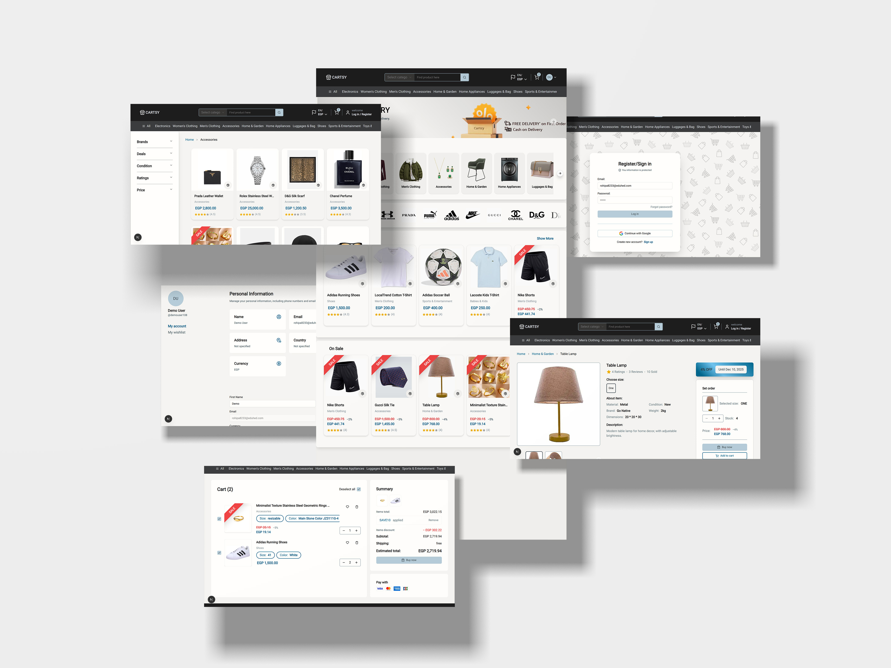

# Cartsy - Modern E-commerce Platform

A full-stack e-commerce application built with Next.js, featuring a modern UI, bilingual support, and comprehensive shopping functionality.

**Live demo** [click here](https://cartsy-xi.vercel.app/)



## 🚀 Features

### Core Functionality

-   **Multiple Product Categories** - Browse products across various categories with intuitive navigation
-   **Guest Shopping** - Add items to cart and browse without creating an account
-   **Secure Authentication** - Required for checkout and order management
-   **Wishlist Management** - Save favorite items for later purchase
-   **Advanced Search & Filtering** - Find products quickly with robust search and filter options
-   **Best Sellers & Deals** - Discover popular products and special offers

### User Experience

-   **Bilingual Support** - Full English and Arabic language support with RTL layout
-   **Responsive Design** - Optimized for all devices (mobile, tablet, desktop)
-   **Modern UI/UX** - Clean, intuitive interface built with Shadcn/ui components
-   **Fast Performance** - Server-side rendering and optimized loading

### Shopping Features

-   **Shopping Cart** - Add, remove, and modify items with real-time updates
-   **Product Search** - Smart search functionality across all products
-   **Category Filtering** - Filter products by category, price, rating, and more
-   **Product Reviews** - Customer reviews and ratings system
-   **Order Management** - Track orders and view purchase history (authenticated users)

## 🛠️ Tech Stack

-   **Framework**: [Next.js 14](https://nextjs.org/) - React framework with App Router
-   **Styling**: [Tailwind CSS](https://tailwindcss.com/) - Utility-first CSS framework
-   **UI Components**: [Shadcn/ui](https://ui.shadcn.com/) - Beautiful, accessible React components
-   **Authentication**: NextAuth.js
-   **Database**: Supabase
-   **State Management**: React Context API or Zustand
-   **Internationalization**: next-intl for bilingual support

## 📦 Installation

### Prerequisites

-   Node.js 18+
-   npm, yarn, or pnpm
-   Database setup supabase

### Setup Instructions

1. **Clone the repository**

```bash
git clone https://github.com/your-username/cartsy.git
cd cartsy
```

2. **Install dependencies**

```bash
npm install
# or
yarn install
# or
pnpm install
```

3. **Environment Configuration**
   Create a `.env.local` file in the root directory:

```env
# Database
DATABASE_URL="your-database-connection-string"

# Authentication
NEXTAUTH_URL="http://localhost:3000"
NEXTAUTH_SECRET="your-nextauth-secret"

# Payment Gateway (if applicable)
STRIPE_PUBLIC_KEY="your-stripe-public-key"
STRIPE_SECRET_KEY="your-stripe-secret-key"

# Other APIs
NEXT_PUBLIC_API_URL="http://localhost:3000/api"
```

4. **Run the development server**

```bash
npm run dev
# or
yarn dev
# or
pnpm dev
```

Open [http://localhost:3000](http://localhost:3000) in your browser.

## 🌐 Bilingual Support

Cartsy supports both English and Arabic languages with proper RTL (Right-to-Left) layout for Arabic.

### Language Features

-   **Dynamic Language Switching** - Users can switch between languages instantly
-   **RTL Layout Support** - Proper Arabic text direction and layout
-   **Localized Content** - All UI text, product descriptions, and user messages
-   **URL Internationalization** - Language-specific URLs (/en/, /ar/)

### Adding Translations

Translations are stored in `/messages/` directory:

-   `en.json` - English translations
-   `ar.json` - Arabic translations

## 📱 Key Pages & Components

### Public Pages

-   **Homepage** - Featured products, deals, and categories
-   **Product Catalog** - Browse all products with filtering
-   **Product Details** - Individual product information and reviews
-   **Category Pages** - Products grouped by categories
-   **Search Results** - Search functionality with filters
-   **Cart** - Shopping cart management (guest access)

### Authenticated Pages

-   **User Dashboard** - Account management
-   **Wishlist** - Saved favorite products
-   **Checkout** - Secure payment process

## 🔐 Authentication Flow

### Guest Users Can:

-   Browse all products and categories
-   Search and filter products
-   Add items to cart
-   View product details and reviews

### Registration Required For:

-   Checkout and payment
-   Wishlist management

## 🛒 Shopping Cart Features

### Guest Cart

-   Add/remove items without registration
-   Persistent cart using localStorage
-   Real-time price calculations
-   Cart item counter in header

### Checkout Process

1. **Review Cart** - Verify items and quantities
2. **Account Creation** - Required for first-time users
3. **Shipping Information** - Delivery address details
4. **Payment** - Secure payment processing
5. **Order Confirmation** - Receipt and tracking information

## 🎨 UI/UX Features

### Design System

-   **Consistent Theming** - Unified color palette and typography
-   **Responsive Grid** - Flexible product layouts
-   **Loading States** - Skeleton loaders and progress indicators
-   **Error Handling** - User-friendly error messages

### Interactive Elements

-   **Hover Effects** - Smooth transitions and animations
-   **Image Galleries** - Product image carousels
-   **Quick Actions** - Add to cart/wishlist buttons
-   **Toast Notifications** - Success and error feedback

## 🚀 Deployment

### Vercel (Recommended)

```bash
npm run prod
```

### Other Platforms

-   **Netlify**: Configure build settings for Next.js
-   **Railway**: Connect your repository for automatic deployments
-   **DigitalOcean**: Use App Platform for easy deployment

## 🤝 Contributing

1. Fork the repository
2. Create your feature branch (`git checkout -b feature/amazing-feature`)
3. Commit your changes (`git commit -m 'Add some amazing feature'`)
4. Push to the branch (`git push origin feature/amazing-feature`)
5. Open a Pull Request

## 📄 License

This project is licensed under the MIT License - see the [LICENSE](LICENSE) file for details.

## 📞 Support

For support and questions:

-   Create an issue in the GitHub repository

## 🙏 Acknowledgments

-   [Next.js](https://nextjs.org/) team for the amazing framework
-   [Shadcn](https://ui.shadcn.com/) for the beautiful UI components
-   [Tailwind CSS](https://tailwindcss.com/) for the utility-first styling
-   Open source community for inspiration and resources

---

**Cartsy** - Built with ❤️ using modern web technologies
