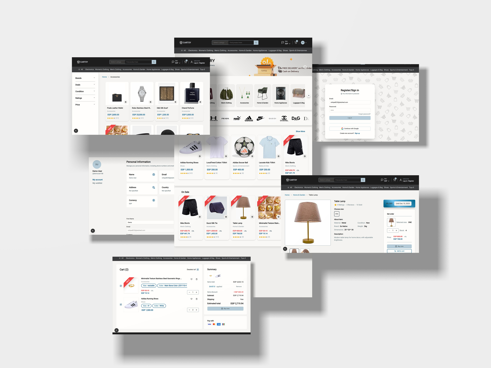

# Cartsy - Modern E-commerce Platform

[](https://opensource.org/licenses/MIT)
[](https://nextjs.org/)
[](https://reactjs.org/)
[](https://supabase.com/)
[](https://tailwindcss.com/)

A full-stack e-commerce application built with Next.js 15, featuring a modern UI, bilingual support (English/Arabic), and comprehensive shopping functionality.



## 🎯 Quick Start

Get Cartsy running in under 5 minutes:

```bash
# 1. Clone the repository
git clone https://github.com/your-username/cartsy.git
cd cartsy

# 2. Install dependencies
npm install

# 3. Set up environment variables
cp .env.example .env.local
# Then edit .env.local with your actual values

# 4. Run the development server
npm run dev
```

Visit [http://localhost:3000](http://localhost:3000) to see your store in action!

## 📋 Table of Contents

- [Features](#-features)
- [Tech Stack](#-tech-stack)
- [Architecture](#-architecture)
- [Project Structure](#-project-structure)
- [Installation](#-installation)
- [Environment Variables](#-environment-variables)
- [Development](#-development)
- [Key Pages & Components](#-key-pages--components)
- [Authentication Flow](#-authentication-flow)
- [Shopping Cart Features](#-shopping-cart-features)
- [UI/UX Features](#-uiux-features)
- [Testing](#-testing)
- [Deployment](#-deployment)
- [API Documentation](#-api-documentation)
- [Bilingual Support](#-bilingual-support)
- [Contributing](#-contributing)
- [Troubleshooting](#-troubleshooting)
- [License](#-license)
- [Support](#-support)
- [Acknowledgments](#-acknowledgments)

## 🚀 Features

### Core Functionality

- **Multiple Product Categories** - Browse products across various categories with intuitive navigation
- **Guest Shopping** - Add items to cart and browse without creating an account
- **Secure Authentication** - Required for checkout and order management
- **Wishlist Management** - Save favorite items for later purchase
- **Advanced Search & Filtering** - Find products quickly with robust search and filter options
- **Best Sellers & Deals** - Discover popular products and special offers

### User Experience

- **Bilingual Support** - Full English and Arabic language support with RTL layout
- **Responsive Design** - Optimized for all devices (mobile, tablet, desktop)
- **Modern UI/UX** - Clean, intuitive interface built with Shadcn/ui components
- **Fast Performance** - Server-side rendering and optimized loading

### Shopping Features

- **Shopping Cart** - Add, remove, and modify items with real-time updates
- **Product Search** - Smart search functionality across all products
- **Category Filtering** - Filter products by category, price, rating, and more
- **Product Reviews** - Customer reviews and ratings system
- **Order Management** - Track orders and view purchase history (authenticated users)

## 🛠️ Tech Stack

### Core Framework

- **Framework**: [Next.js 15.2](https://nextjs.org/) - React framework with App Router and Turbopack
- **Language**: JavaScript (ES6+) with React 19.0
- **Runtime**: Node.js 18+ (required to run Next.js frontend)
- **Backend**: [Supabase](https://supabase.com/) - Serverless PostgreSQL database and backend services

### Styling & UI

- **Styling**: [Tailwind CSS 4](https://tailwindcss.com/) - Utility-first CSS framework
- **UI Components**: [Shadcn/ui](https://ui.shadcn.com/) - Beautiful, accessible React components (New York style)
- **Icons**: [Lucide React](https://lucide.dev/) - Modern icon library
- **Animations**: [Tailwind Animate CSS](https://www.npmjs.com/package/tw-animate-css)

### Backend & Database

- **Backend Platform**: [Supabase](https://supabase.com/) - Complete backend-as-a-service solution
    - PostgreSQL database with real-time capabilities
    - Built-in authentication and authorization
    - Real-time subscriptions
    - Storage for files and images
    - Edge functions for serverless logic
- **Authentication**: [NextAuth.js v5](https://authjs.org/) - Enhanced with Supabase integration
- **State Management**: React Context API & React Hooks
- **Form Handling**: [React Hook Form](https://react-hook-form.com/) with Zod validation

### Payment & Integrations

- **Payment**: [Stripe](https://stripe.com/) - Secure payment processing
- **Internationalization**: [next-intl](https://next-intl-docs.vercel.app/) - Bilingual support (English/Arabic)
- **Date Handling**: [date-fns](https://date-fns.org/) - Modern date utility library

### Development Tools

- **Package Manager**: npm
- **Linting**: ESLint with Next.js config
- **Code Quality**: Built-in linting and formatting
- **Build Tool**: Next.js Turbopack for faster development
- **Note**: Node.js is only required to run the Next.js frontend development server and build process. All backend services are provided by Supabase.

## 🏗️ Architecture

### Technology Overview

Cartsy uses a modern frontend framework with a serverless backend:

- **Frontend**: Next.js 15 with React 19 (requires Node.js to run the development server and build process)
- **Backend**: Supabase (complete backend-as-a-service platform)
- **Architecture Type**: JAMstack (JavaScript, APIs, Markup) with serverless backend
- **No custom Node.js backend**: All backend logic (database, auth, storage) handled by Supabase services

### Application Structure

Cartsy follows a modern Next.js App Router architecture with Supabase as the backend:

- **Server-Side Rendering (SSR)**: For SEO and performance
- **Client-Side Rendering (CSR)**: For interactive components
- **Supabase Backend**: Complete backend-as-a-service (database, auth, storage, edge functions)
- **API Routes**: Serverless functions for secure operations (Stripe payments, webhooks)
- **Middleware**: For authentication and internationalization
- **Component Architecture**: Reusable UI components with separation of concerns

### Data Flow

1. **Client Components**: Handle user interactions and state
2. **Server Components**: Fetch data directly from Supabase (database, auth, storage)
3. **Supabase Client**: Communicates with Supabase backend for all data operations
4. **API Routes**: Process secure operations (Stripe payments, webhooks)
5. **Context API**: Manage global state (cart, user session from Supabase Auth)

### Authentication Flow

- NextAuth.js v5 handles authentication flows, integrated with Supabase Auth
- Supabase provides secure user authentication (email/password, OAuth providers)
- User data stored in Supabase database with proper RLS policies
- Session management with secure cookies via NextAuth
- Protected routes for authenticated users using middleware

## 📁 Project Structure

```
cartsy/
├── public/                 # Static assets (images, fonts)
├── src/
│   ├── app/               # Next.js App Router pages
│   │   ├── [locale]/      # Internationalized routes
│   │   │   ├── account/   # User account pages
│   │   │   ├── auth/      # Authentication pages
│   │   │   ├── cart/      # Shopping cart
│   │   │   ├── checkout/  # Checkout process
│   │   │   └── products/  # Product pages
│   │   ├── _auth/         # NextAuth configuration
│   │   ├── _components/   # Page-specific components
│   │   └── api/           # API routes
│   ├── components/        # Reusable UI components
│   │   └── ui/            # Shadcn/ui components
│   ├── lib/               # Utility functions
│   └── middleware.js      # Next.js middleware
├── data/                  # Static data files
├── design/                # Design assets and mockups
├── components.json        # Shadcn/ui configuration
├── next.config.mjs        # Next.js configuration
├── tailwind.config.js     # Tailwind CSS configuration
└── package.json           # Dependencies and scripts
```

### Key Directories Explained

- **`src/app/[locale]`**: Internationalized pages using next-intl
- **`src/app/_components`**: Organized by feature (account, auth, cart, etc.)
- **`src/components/ui`**: Reusable Shadcn/ui components
- **`src/lib`**: Shared utilities and helper functions
- **`data`**: Static data for development and testing

## 📦 Installation

### Prerequisites

Before you begin, ensure you have the following installed:

- **Node.js** 18 or higher ([Download](https://nodejs.org/)) - Required to run the Next.js frontend application
- **npm** (comes with Node.js) or your preferred package manager
- **Git** ([Download](https://git-scm.com/downloads))
- **Supabase Account** ([Sign up](https://supabase.com/)) - Provides complete backend services (database, auth, storage, edge functions)
- **Stripe Account** ([Sign up](https://stripe.com/)) for payment processing (optional)

### Setup Instructions

1. **Clone the repository**

```bash
git clone https://github.com/your-username/cartsy.git
cd cartsy
```

2. **Install dependencies**

```bash
npm install
```

3. **Environment Configuration**
   Copy the example environment file and configure it:

```bash
cp .env.example .env.local
```

Then edit `.env.local` with your actual values (see [Environment Variables](#-environment-variables) below)

4. **Set up Supabase Backend**
    - Create a new project in Supabase dashboard
    - Run the SQL schema provided in the `/data` directory to set up database tables
    - Configure Row Level Security (RLS) policies for data protection
    - Enable authentication providers (Google, email/password) in Supabase Auth
    - Set up storage buckets for product images and categories
    - Configure edge functions if needed for custom backend logic

5. **Set up Stripe (Optional)**
    - Create a Stripe account and get API keys
    - Add Stripe public and secret keys to `.env.local`
    - Configure webhooks for payment success handling

6. **Run the development server**

```bash
npm run dev
```

The application will be available at [http://localhost:3000](http://localhost:3000)

## 🔐 Environment Variables

Create a `.env.local` file in the root directory with the following variables:

```env
# Application
NEXT_URL="http://localhost:3000"
NEXT_PUBLIC_API_URL="http://localhost:3000/api"

# Supabase
NEXT_PUBLIC_SUPABASE_URL="your-supabase-project-url"
NEXT_PUBLIC_SUPABASE_ANON_KEY="your-supabase-anon-key"
SUPABASE_SERVICE_ROLE_KEY="your-supabase-service-role-key"

# NextAuth.js
NEXTAUTH_SECRET="generate-a-random-secret-here"
NEXTAUTH_URL="http://localhost:3000"

# Stripe (Optional - for payment processing)
NEXT_PUBLIC_STRIPE_PUBLISHABLE_KEY="pk_test_your_key"
STRIPE_SECRET_KEY="sk_test_your_key"
STRIPE_WEBHOOK_SECRET="whsec_your_webhook_secret"

# Google OAuth (Optional)
GOOGLE_CLIENT_ID="your-google-client-id"
GOOGLE_CLIENT_SECRET="your-google-client-secret"

# Other Services
NEXT_PUBLIC_GOOGLE_MAPS_API_KEY="your-maps-api-key" # Optional
```

### Generating Secrets

For `NEXTAUTH_SECRET`, generate a secure random string:

```bash
# On Linux/Mac
openssl rand -base64 32

# On Windows
powershell -Command "Add-Type -AssemblyName System.Web; [System.Web.Security.Membership]::GeneratePassword(32,4)"
```

## 💻 Development

### Available Scripts

```bash
# Start development server with Turbopack (faster)
npm run dev

# Build for production
npm run build

# Start production server
npm start

# Build and start production server
npm run prod

# Run ESLint
npm run lint
```

### Development Workflow

1. **Feature Development**
    - Create a new branch for your feature
    - Make changes following the existing code style
    - Test your changes locally
    - Run linting before committing

2. **Code Style**
    - Follow the existing naming conventions
    - Use Shadcn/ui components for UI elements
    - Keep components small and focused
    - Use Tailwind CSS for styling

3. **Testing Changes**
    - Test on multiple devices (mobile, tablet, desktop)
    - Test both English and Arabic languages
    - Test authentication flows
    - Test cart and checkout processes

### Hot Reloading

The development server supports hot module replacement (HMR) for fast development. Changes to components, styles, and most files will automatically reload in the browser.

### Debugging

- Use `console.log` statements for quick debugging
- Enable React DevTools in your browser
- Check the browser console for errors
- Use Next.js built-in error overlay

## 📱 Key Pages & Components

### Public Pages

- **Homepage** (`/`) - Featured products, deals, and categories
- **Product Catalog** (`/products`) - Browse all products with filtering
- **Product Details** (`/products/[category]/[productId]`) - Individual product information and reviews
- **Category Pages** (`/products/[category]`) - Products grouped by categories
- **Search Results** - Search functionality with filters
- **Cart** (`/cart`) - Shopping cart management (guest access)
- **About Us** (`/about-us`) - Company information
- **Contact Us** (`/contact-us`) - Contact form and information
- **Help** (`/help`) - FAQ and support pages

### Authenticated Pages

- **User Dashboard** (`/account`) - Account management overview
- **Orders** (`/account/orders`) - Order history and tracking
- **Order Details** (`/account/orders/[orderId]`) - Detailed order information
- **Wishlist** (`/account/wishlist`) - Saved favorite products
- **Settings** (`/account/settings`) - Account settings and preferences
- **Payments** (`/account/payments`) - Payment methods management

### Authentication Pages

- **Login** (`/auth/login`) - User login
- **Signup** (`/auth/signup`) - New user registration
- **Forgot Password** (`/auth/forgot-password`) - Password recovery
- **Update Password** (`/auth/update-password`) - Password change

### Checkout Flow

- **Checkout** (`/checkout`) - Secure payment process
- **Payment Success** (`/payment-success`) - Order confirmation page

## 🔐 Authentication Flow

### Guest Users Can:

- Browse all products and categories
- Search and filter products
- Add items to cart
- View product details and reviews
- Access public pages (About, Contact, Help)

### Registration Required For:

- Checkout and payment
- Wishlist management
- Order history and tracking
- Account settings
- Payment method management

## 🛒 Shopping Cart Features

### Guest Cart

- Add/remove items without registration
- Persistent cart using localStorage
- Real-time price calculations
- Cart item counter in header
- Quantity adjustments
- Product variant selection

### Checkout Process

1. **Review Cart** - Verify items and quantities
2. **Account Creation** - Required for first-time users
3. **Shipping Information** - Delivery address details
4. **Payment** - Secure payment processing via Stripe
5. **Order Confirmation** - Receipt and tracking information

## 🎨 UI/UX Features

### Design System

- **Consistent Theming** - Unified color palette and typography
- **Responsive Grid** - Flexible product layouts
- **Loading States** - Skeleton loaders and progress indicators
- **Error Handling** - User-friendly error messages
- **Toast Notifications** - Success and error feedback

### Interactive Elements

- **Hover Effects** - Smooth transitions and animations
- **Image Galleries** - Product image carousels
- **Quick Actions** - Add to cart/wishlist buttons
- **Modal Dialogs** - Quick view and additional information
- **Drawer Components** - Slide-out panels for cart and filters
- **Keyboard Navigation** - Full keyboard accessibility support

## 🧪 Testing

### Current Testing Status

Currently, Cartsy does not have automated test suites configured. The following testing approaches are recommended:

### Manual Testing Checklist

- [ ] User registration and login
- [ ] Password reset functionality
- [ ] Product browsing and search
- [ ] Add to cart and cart management
- [ ] Checkout process
- [ ] Payment processing (Stripe)
- [ ] Order history and tracking
- [ ] Wishlist functionality
- [ ] Language switching (English/Arabic)
- [ ] Responsive design on mobile/tablet/desktop
- [ ] Form validation
- [ ] Error handling

### Recommended Testing Tools

To add automated testing to this project, consider:

- **Jest** + **React Testing Library** for unit and integration tests
- **Playwright** or **Cypress** for end-to-end testing
- **Storybook** for component testing and documentation

### Setting Up Testing (Future Enhancement)

To add testing support:

```bash
# Install testing dependencies
npm install --save-dev @testing-library/react @testing-library/jest-dom jest jest-environment-jsdom

# For E2E testing
npm install --save-dev @playwright/test
```

## 🚀 Deployment

## 🌐 Bilingual Support

Cartsy supports both English and Arabic languages with proper RTL (Right-to-Left) layout for Arabic.

### Language Features

- **Dynamic Language Switching** - Users can switch between languages instantly
- **RTL Layout Support** - Proper Arabic text direction and layout
- **Localized Content** - All UI text, product descriptions, and user messages
- **URL Internationalization** - Language-specific URLs (/en/, /ar/)
- **Localized SEO** - Different meta tags for each language

### Implementation Details

The bilingual support is implemented using `next-intl`:

```javascript
// middleware.js handles locale detection
export default createMiddleware({
    locales: ["en", "ar"],
    defaultLocale: "en",
    localePrefix: "as-needed",
});
```

### Adding Translations

Translations are stored in the `/messages/` directory:

- `en.json` - English translations
- `ar.json` - Arabic translations

**Example translation structure:**

```json
{
    "common": {
        "addToCart": "Add to Cart",
        "checkout": "Checkout"
    },
    "home": {
        "welcome": "Welcome to Cartsy"
    }
}
```

**Adding new translations:**

1. Add the key to both `en.json` and `ar.json`
2. Use the translation in components:

```javascript
import { useTranslations } from "next-intl";

function MyComponent() {
    const t = useTranslations("common");
    return <button>{t("addToCart")}</button>;
}
```

### RTL Considerations

When adding new components for Arabic support:

- Use logical CSS properties (`margin-inline-start` instead of `margin-left`)
- Test with both language directions
- Ensure proper text alignment
- Check icon and layout flipping

## 🤝 Contributing

## 📱 Key Pages & Components

### Public Pages

- **Homepage** - Featured products, deals, and categories
- **Product Catalog** - Browse all products with filtering
- **Product Details** - Individual product information and reviews
- **Category Pages** - Products grouped by categories
- **Search Results** - Search functionality with filters
- **Cart** - Shopping cart management (guest access)

### Authenticated Pages

- **User Dashboard** - Account management
- **Wishlist** - Saved favorite products
- **Checkout** - Secure payment process

## 🔐 Authentication Flow

### Guest Users Can:

- Browse all products and categories
- Search and filter products
- Add items to cart
- View product details and reviews

### Registration Required For:

- Checkout and payment
- Wishlist management

## 🛒 Shopping Cart Features

### Guest Cart

- Add/remove items without registration
- Persistent cart using localStorage
- Real-time price calculations
- Cart item counter in header

### Checkout Process

1. **Review Cart** - Verify items and quantities
2. **Account Creation** - Required for first-time users
3. **Shipping Information** - Delivery address details
4. **Payment** - Secure payment processing
5. **Order Confirmation** - Receipt and tracking information

## 🎨 UI/UX Features

### Design System

- **Consistent Theming** - Unified color palette and typography
- **Responsive Grid** - Flexible product layouts
- **Loading States** - Skeleton loaders and progress indicators
- **Error Handling** - User-friendly error messages

### Interactive Elements

- **Hover Effects** - Smooth transitions and animations
- **Image Galleries** - Product image carousels
- **Quick Actions** - Add to cart/wishlist buttons
- **Toast Notifications** - Success and error feedback

## 🚀 Deployment

### Vercel (Recommended)

Vercel provides the best deployment experience for Next.js applications:

1. **Connect your repository** to Vercel
2. **Add environment variables** in Vercel dashboard
3. **Deploy** - Vercel will automatically build and deploy

```bash
# Build locally before deploying
npm run build

# Or let Vercel handle the build
# Just push to your connected repository
```

**Vercel Environment Variables:**

- Add all variables from `.env.local` to Vercel project settings
- Update `NEXT_URL` to your production domain
- Update `NEXTAUTH_URL` to your production domain

### Other Platforms

#### Netlify

```toml
# netlify.toml
[build]
  command = "npm run build"
  publish = ".next"

[[plugins]]
  package = "@netlify/plugin-nextjs"
```

#### Railway

- Connect your GitHub repository
- Railway will detect Next.js and configure automatically
- Add environment variables in Railway dashboard

#### Docker

```dockerfile
# Dockerfile
FROM node:18-alpine AS base

# Install dependencies only when needed
FROM base AS deps
WORKDIR /app
COPY package*.json ./
RUN npm ci

# Rebuild the source code only when needed
FROM base AS builder
WORKDIR /app
COPY --from=deps /app/node_modules ./node_modules
COPY . .
RUN npm run build

# Production image
FROM base AS runner
WORKDIR /app
ENV NODE_ENV production
COPY --from=builder /app/public ./public
COPY --from=builder /app/.next/standalone ./
COPY --from=builder /app/.next/static ./.next/static

EXPOSE 3000
CMD ["node", "server.js"]
```

### Production Checklist

Before deploying to production:

- [ ] Update all environment variables
- [ ] Configure production database
- [ ] Set up SSL certificates
- [ ] Configure CDN for static assets
- [ ] Enable analytics
- [ ] Set up error monitoring (Sentry, LogRocket)
- [ ] Configure email services
- [ ] Test payment gateway in production mode
- [ ] Set up backup strategies
- [ ] Configure webhooks

## 📡 API Documentation

### API Routes

Cartsy includes several API routes for backend functionality:

#### Payment API

```
POST /api/create-payment-intent
```

Creates a Stripe payment intent for checkout.

**Request:**

```json
{
  "amount": 1000,
  "currency": "usd",
  "items": [...]
}
```

**Response:**

```json
{
    "clientSecret": "pi_12345_secret_abc",
    "paymentIntentId": "pi_12345"
}
```

#### Currency Exchange API

```
GET /api/currency-exchange?from=USD&to=EUR
```

Gets current exchange rates.

#### Reverse Geocoding API

```
GET /api/reverse-geocode?lat=40.7128&lng=-74.0060
```

Converts coordinates to address information.

### Authentication Endpoints

NextAuth.js provides standard authentication endpoints:

- `/api/auth/signin` - Sign in page
- `/api/auth/signout` - Sign out
- `/api/auth/callback` - OAuth callbacks
- `/api/auth/session` - Get current session

### Database Schema

The database schema is managed through Supabase's PostgreSQL database. Key tables include:

- `users` - User accounts and profiles (managed by Supabase Auth)
- `products` - Product information
- `categories` - Product categories
- `orders` - Order information
- `order_items` - Items in each order
- `reviews` - Product reviews
- `wishlists` - User wishlists

All database operations are performed through Supabase's client SDK, which provides:

- Automatic connection pooling
- Real-time data subscriptions
- Built-in security via Row Level Security (RLS)
- Type-safe queries

For detailed schema information, refer to the SQL files in the `/data` directory.

## 🤝 Contributing

We welcome contributions to Cartsy! Please follow these guidelines to ensure a smooth contribution process.

### How to Contribute

1. **Fork the repository**

    ```bash
    # Fork the repository on GitHub
    # Clone your fork locally
    git clone https://github.com/your-username/cartsy.git
    cd cartsy
    ```

2. **Create a feature branch**

    ```bash
    git checkout -b feature/amazing-feature
    # or
    git checkout -b fix/bug-description
    ```

3. **Make your changes**
    - Follow the existing code style and conventions
    - Add comments for complex logic
    - Update documentation if needed
    - Test your changes thoroughly

4. **Commit your changes**

    ```bash
    git add .
    git commit -m "feat: add amazing feature"
    # or
    git commit -m "fix: resolve bug description"
    ```

    **Commit message format:**
    - `feat:` - New feature
    - `fix:` - Bug fix
    - `docs:` - Documentation changes
    - `style:` - Code style changes (formatting, etc.)
    - `refactor:` - Code refactoring
    - `test:` - Adding or updating tests
    - `chore:` - Maintenance tasks

5. **Push to your branch**

    ```bash
    git push origin feature/amazing-feature
    ```

6. **Open a Pull Request**
    - Provide a clear description of your changes
    - Reference any related issues
    - Include screenshots for UI changes
    - Ensure all checks pass

### Contribution Guidelines

#### Code Style

- Follow existing code patterns and conventions
- Use meaningful variable and function names
- Keep functions small and focused
- Add comments for complex logic
- Run `npm run lint` before committing

#### Component Guidelines

- Use Shadcn/ui components when possible
- Make components reusable and composable
- Add TypeScript prop types (if adding TypeScript)
- Include proper error handling
- Consider accessibility (ARIA labels, keyboard navigation)

#### Documentation

- Update README.md for significant changes
- Add comments for complex functions
- Document new API endpoints
- Update environment variable documentation

#### Testing

- Test your changes on multiple devices
- Test both English and Arabic languages
- Test authentication flows
- Test cart and checkout processes

### Reporting Issues

When reporting bugs or suggesting features:

1. **Search existing issues** first to avoid duplicates
2. **Use the issue template** if available
3. **Provide detailed information**:
    - Steps to reproduce
    - Expected behavior
    - Actual behavior
    - Screenshots (if applicable)
    - Environment details (OS, browser, Node.js version)

### Code of Conduct

- Be respectful and inclusive
- Provide constructive feedback
- Focus on what is best for the community
- Show empathy towards other community members

## 🔧 Troubleshooting

### Common Issues and Solutions

#### Build Errors

**Issue: Build fails with "Module not found"**

```bash
# Solution: Clear cache and reinstall dependencies
rm -rf node_modules .next
npm install
npm run build
```

**Issue: TypeScript errors**

```bash
# Solution: Ensure all dependencies are installed
npm install
# Check for version conflicts
npm list
```

#### Development Issues

**Issue: Development server won't start**

```bash
# Solution: Check if port 3000 is in use
# Kill process on port 3000 (Windows)
netstat -ano | findstr :3000
taskkill /PID <PID> /F

# Then restart
npm run dev
```

**Issue: Hot reloading not working**

```bash
# Solution: Restart the dev server
# Press Ctrl+C to stop, then:
npm run dev
```

#### Environment Issues

**Issue: Environment variables not loading**

```bash
# Solution: Ensure .env.local exists and has correct format
# Check for spaces around equals signs
# Restart dev server after changes
```

**Issue: Supabase connection errors**

```bash
# Solution: Verify your Supabase credentials
# Check that your Supabase project is active
# Ensure RLS policies allow access
# Verify NEXT_PUBLIC_SUPABASE_URL and keys are correct
# Note: No Node.js backend needed - Supabase handles all backend operations
```

#### Authentication Issues

**Issue: NextAuth configuration errors**

```bash
# Solution: Generate a new NEXTAUTH_SECRET
# Verify NEXTAUTH_URL matches your domain
# Check OAuth provider credentials
```

**Issue: Google OAuth not working**

```bash
# Solution: Verify Google OAuth callback URL
# Ensure callback URL is whitelisted in Google Console
# Check that CLIENT_ID and CLIENT_SECRET are correct
```

#### Payment Issues

**Issue: Stripe payment errors**

```bash
# Solution: Verify Stripe API keys
# Check that webhook is configured
# Ensure your Stripe account is in test mode for development
```

#### Performance Issues

**Issue: Slow page loads**

```bash
# Solution: Check image optimization
# Verify database queries are optimized
# Consider implementing caching
# Check bundle size with next analyze
```

### Getting Help

If you encounter issues not covered here:

1. **Check the logs** - Look at browser console and terminal output
2. **Search GitHub issues** - See if others have encountered similar problems
3. **Check documentation** - Review relevant framework documentation
4. **Create an issue** - Provide detailed information about your problem

## 📄 License

## 📄 License

This project is licensed under the MIT License - see the [LICENSE](LICENSE) file for details.

**Summary:**

- ✅ Commercial use
- ✅ Modification
- ✅ Distribution
- ✅ Private use
- ❗ Liability limitation
- ❗ Warranty disclaimer

## 📞 Support

### Getting Help

- **GitHub Issues**: [Create an issue](https://github.com/your-username/cartsy/issues) for bug reports and feature requests
- **Documentation**: Check this README and inline code comments
- **Community**: Join discussions in GitHub Discussions (if enabled)

### Security Issues

For security vulnerabilities, please do not open a public issue. Instead, send an email to security@example.com with details about the vulnerability.

## 🙏 Acknowledgments

### Core Technologies

- [Next.js](https://nextjs.org/) - The React framework for production
- [React](https://reactjs.org/) - A JavaScript library for building user interfaces
- [Tailwind CSS](https://tailwindcss.com/) - Utility-first CSS framework
- [Shadcn/ui](https://ui.shadcn.com/) - Beautiful and accessible component library

### Backend Services

- [Supabase](https://supabase.com/) - Complete backend-as-a-service platform (PostgreSQL database, authentication, storage, real-time, edge functions)
- [NextAuth.js](https://authjs.org/) - Authentication for Next.js, integrated with Supabase Auth
- [Stripe](https://stripe.com/) - Payments infrastructure for the internet

### Development Tools

- [Vercel](https://vercel.com/) - Platform for frontend frameworks
- [ESLint](https://eslint.org/) - Find and fix problems in JavaScript code
- [Radix UI](https://www.radix-ui.com/) - Unstyled, accessible UI components

### Inspiration & Resources

- Open source community for inspiration and resources
- Design patterns from modern e-commerce platforms
- Accessibility guidelines from WCAG

## 📊 Project Status

### Current Version: 0.1.0

This is an active development project. Features and APIs may change as we continue to improve the platform.

### Roadmap

#### Phase 1: Core Enhancements

- [ ] Add comprehensive automated testing (Jest, Playwright)
- [ ] Implement advanced analytics and reporting
- [ ] Add more payment gateways (PayPal, Apple Pay)
- [ ] Implement product recommendations engine
- [ ] Add admin dashboard for store management

#### Phase 2: Advanced Features

- [ ] Implement advanced search with filters
- [ ] Add multi-currency support
- [ ] Implement loyalty/rewards program
- [ ] Add more social login options (Facebook, Twitter)
- [ ] Implement live chat support

#### Phase 3: Platform Improvements

- [ ] Progressive Web App (PWA) support
- [ ] Offline functionality
- [ ] Voice search
- [ ] AR product visualization
- [ ] AI-powered shopping assistant

## 📚 Additional Documentation

- [Contributing Guide](CONTRIBUTING.md) - Guidelines for contributing to the project
- [Testing Guide](TESTING.md) - Comprehensive testing instructions
- [Environment Setup](.env.example) - Environment variables template

## 🔗 Related Resources

- [Next.js Documentation](https://nextjs.org/docs)
- [Tailwind CSS Documentation](https://tailwindcss.com/docs)
- [Shadcn/ui Documentation](https://ui.shadcn.com/docs)
- [Supabase Documentation](https://supabase.com/docs)
- [NextAuth.js Documentation](https://authjs.dev)
- [Stripe Documentation](https://stripe.com/docs)
- [next-intl Documentation](https://next-intl-docs.vercel.app/)

## 🌟 Star History

If you find this project useful, please consider giving it a ⭐ on GitHub!

## 📮 Contact

- **Project Maintainer**: Your Name
- **Email**: your.email@example.com
- **Website**: https://cartsy.example.com
- **Twitter**: [@cartsy](https://twitter.com/cartsy)

---

<div align="center">

**Cartsy** - Built with ❤️ using modern web technologies

[⬆ Back to Top](#cartsy---modern-e-commerce-platform)

</div>
